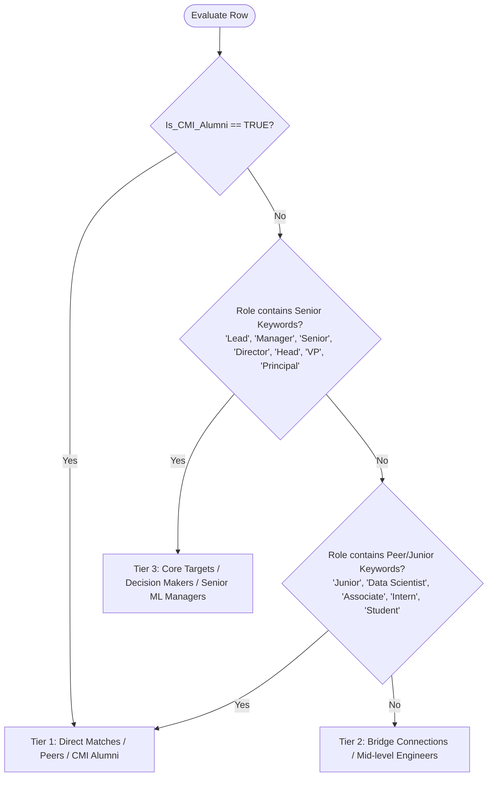

# Product Specification: Proximity Networking App (v0)

**Document Status:** Ready for Review  
**Version:** 0.1  
**Author:** AI Product Manager  
**Platform:** Google Sheets + Google Apps Script + Groq API  

---

## 1. Product Overview & Goal
The **Proximity Networking App** is an agentic outreach workflow engine built inside Google Sheets. It analyzes target professional connections against a candidate baseline profile (Chennai Mathematical Institute Data Science coursework + technical projects), classifies connection tiers, selects the highest-relevance project asset, and synthesizes concise, high-converting icebreaker messages using the Groq API.

---

## 2. User Baseline Profile & Asset Catalog

### Baseline Background
* **Education:** 2 Years of rigorous Data Science & Mathematical coursework at Chennai Mathematical Institute (CMI).
* **Core Competencies:** Time-series telemetry, deep learning, mathematical optimization, rapid full-stack data application prototyping.

### Asset & Project Catalog
| Asset Key | Asset Title / Domain | Technical Focus | Matching Triggers (Keywords) |
| :--- | :--- | :--- | :--- |
| **ASSET_RUL** | **Predictive Maintenance RUL Copilot** | CNN-Transformer hybrid architecture for Remaining Useful Life (RUL) prediction on high-frequency sensor streams. | `IoT`, `Manufacturing`, `Industrial`, `Hardware`, `Sensors`, `Time-Series`, `Predictive`, `Automotive` |
| **ASSET_LP** | **Mathematical Optimization & Linear Programming** | Complex Linear Programming (LP) and Mixed-Integer Linear Programming (MILP) formulations for decision intelligence. | `Operations`, `Logistics`, `Strategy`, `Supply Chain`, `Optimization`, `Finance`, `Routing`, `Planning` |
| **ASSET_STREAMLIT** | **Interactive Data Application Prototyping** | Building, containerizing, and deploying interactive machine learning and data applications via Streamlit. | `Product`, `Front-end`, `Engineering`, `App`, `Deployment`, `Platform`, `Full-Stack`, `UI/UX`, `SaaS` |

---

## 3. Google Sheet Schema & Data Dictionary

| Column Index | Column Header | Data Type | Field Category | Description / Validation |
| :---: | :--- | :--- | :--- | :--- |
| **A** | `Target_Name` | Text | Input | Full name of the target connection |
| **B** | `Role` | Text | Input | Job title (e.g., *Senior ML Engineer*, *Director of AI*, *Product Lead*) |
| **C** | `Company` | Text | Input | Employer name (e.g., *Siemens*, *Uber*, *Amazon*) |
| **D** | `LinkedIn_URL` | URL | Input | Profile link (for quick manual review) |
| **E** | `Is_CMI_Alumni` | Checkbox (Boolean) | Input | `TRUE` if target is an alumnus/peer of CMI |
| **F** | `Networking_Objective` | Dropdown | Input | `Employment` or `Collaboration` |
| **G** | `Tier` | Text | Computed (Script) | Connection classification: `Tier 1`, `Tier 2`, or `Tier 3` |
| **H** | `Recommended_Asset` | Text | Computed (Script/LLM) | Matched project key / technical synergy description |
| **I** | `Icebreaker_Draft` | Text | Generated (Gemini) | Generated personalized outreach message (<60 words) |
| **J** | `Status` | Text / Status | Workflow | `Ready`, `Processing`, `Generated`, `Sent`, `Error` |

---

## 4. Tiering System Logic (Hybrid Rule Engine)

The system assigns a **Tier** using deterministic rules based on institutional proximity and organizational seniority:



### Tier Definitions
1. **Tier 1 (Direct Matches & Peers):** CMI alumni, student researchers, and peer Data Scientists. Strategy: High rapport, academic kinship, and peer collaboration.
2. **Tier 2 (Bridge Connections):** Mid-level ICs, Software Engineers, and adjacent technical specialists. Strategy: Technical synergy, shared stack curiosity.
3. **Tier 3 (Core Targets & Decision Makers):** Senior Managers, Staff ML Engineers, Team Leads, and Directors. Strategy: High-signal architecture insights, low-friction advice-seeking.

---

## 5. Project Matching Matrix & Objective Strategy

| Networking Objective | Strategy & Angle | Expected Asset Output Format |
| :--- | :--- | :--- |
| **Employment** | Highlight concrete technical rigor, architectural mastery, and business impact. | Recommends a specific project title + core metric/architecture to highlight. |
| **Collaboration** | Propose technical synergy, mutual research interests, or toolchain discussions. | Suggests a specific shared technical challenge or architecture exploration. |

### Domain Trigger Matrix
* `IoT` / `Manufacturing` / `Industrial` / `Sensors` $\rightarrow$ **Predictive Maintenance RUL Copilot (CNN-Transformer)**
* `Operations` / `Logistics` / `Strategy` / `Supply Chain` $\rightarrow$ **Mathematical Optimization (Linear Programming Models)**
* `Product` / `Front-end` / `Engineering` / `Platform` $\rightarrow$ **Streamlit Data App Deployments**
* *Sparse / Unmatched Role* $\rightarrow$ **CMI Data Science Baseline + Transition/Stack Inquiry (Fallback)**

---

## 6. Groq Generation Engine & Prompt Architecture

### System Directive
The generation engine calls the Groq API via Google Apps Script with structured JSON output requirements.

### Acceptance Criteria for Icebreaker
1. **Length Constraint:** Strictly under **60 words**.
2. **Personalized Hook:** Explicitly references target's company/role (or CMI commonality if `Is_CMI_Alumni` is true).
3. **Relevant Asset Bridge:** Concisely anchors the matched project or technical skill without overselling.
4. **Low-Friction Call to Action (CTA):** Requests brief feedback on an architecture/formulation choice; strictly avoids direct asks for job referrals or lengthy calls.
5. **Tone:** Respectful, crisp, technically competent, humble yet sharp.

### Prompt Template Specification
```
System: You are an elite AI networking strategist crafting ultra-short LinkedIn outreach messages for a Data Science student at Chennai Mathematical Institute (CMI).

Candidate Profile:
- 2 Years Data Science & Math Coursework at Chennai Mathematical Institute (CMI)
- Technical Asset 1: Predictive Maintenance RUL Copilot (CNN-Transformer architecture)
- Technical Asset 2: Mathematical Optimization (Complex Linear Programming models)
- Technical Asset 3: Interactive Data Applications & ML Prototyping (Streamlit deployments)

Input Data:
- Target Name: {{Target_Name}}
- Role: {{Role}}
- Company: {{Company}}
- Is CMI Alumni: {{Is_CMI_Alumni}}
- Objective: {{Networking_Objective}}
- Target Tier: {{Tier}}
- Matched Asset: {{Recommended_Asset}}

Rules:
1. Message MUST be under 60 words total.
2. If CMI Alumni is TRUE, mention the shared CMI connection as the opening hook.
3. If Objective == "Employment", reference the matched project as a reference point for seeking technical advice.
4. If Objective == "Collaboration", propose a quick technical synergy or architecture point.
5. End with a low-friction CTA (e.g., "Would love 2 mins of your thoughts on [specific topic] when convenient.").
6. Fallback Rule: If role details are sparse, craft a genuine question about their transition/growth into {{Company}}.
```

---

## 7. Apps Script Technical Architecture

1. **Custom UI Menu:**
   * `Proximity Networking -> Generate Selected Rows`
   * `Proximity Networking -> Generate All Pending`
   * `Proximity Networking -> Configure Groq API Key`
2. **Script Execution Flow:**
   1. Read active spreadsheet sheet `Targets`.
   2. Iterate over rows where `Status` is empty, `Ready`, or `Pending`.
   3. Compute `Tier` locally using regular expressions and boolean logic.
   4. Map `Recommended_Asset` based on keyword taxonomy.
   5. Construct payload and execute HTTP POST to `https://api.groq.com/openai/v1/chat/completions`.
   6. Write back `Tier`, `Recommended_Asset`, `Icebreaker_Draft`, and set `Status = "Generated"`.
3. **Error Handling & Quotas:**
   * Script property storage (`PropertiesService.getUserProperties()`) for API keys (`GROQ_API_KEY`).
   * Rate limit back-off (sleep 400ms between calls).
   * Visual error status (`Status = "Error: [Reason]"`) on API or parsing failures.

---

## 8. Definition of Done & Acceptance Test Cases

* [ ] **Test Case 1 (CMI Alumni + IoT):** Target at an industrial firm with CMI flag set $\rightarrow$ Output is Tier 1, Asset is RUL Copilot, message references CMI and sensor architecture (<60 words).
* [ ] **Test Case 2 (Senior Manager + Logistics):** Target is "VP of Supply Chain Analytics" $\rightarrow$ Output is Tier 3, Asset is Linear Programming, message seeks brief perspective on optimization formulations (<60 words).
* [ ] **Test Case 3 (Sparse Data / General):** Target role is generic or empty $\rightarrow$ Output triggers fallback transition hook (<60 words).
* [ ] **Test Case 4 (Word Count Enforcement):** Automated word count validator ensures all generated outputs remain $\le 60$ words.
